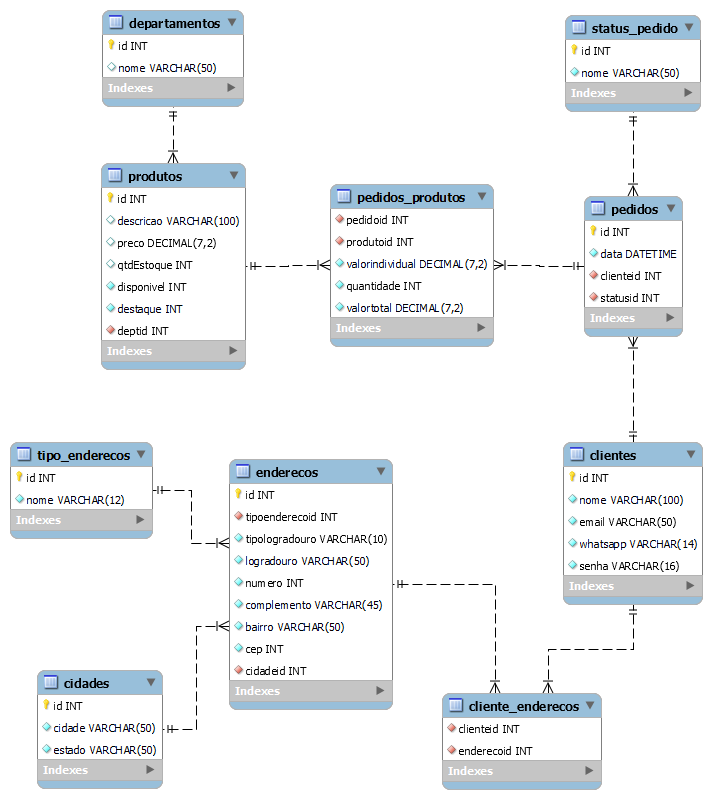

## DESAFIO INDIVIDUAL 3

### **Modelagem**


 </p>

---

### **Criação do BD**

```sql
CREATE SCHEMA `gama-ecommerce` ;
```

---

### **Criação das tabelas**

**Arquivo com todos os scripts de instruções de criação das tabelas:**
[Instrucoes_criacao_tabelas.sql](src/Instrucoes_criacao_tabelas.sql)

**Scripts de criação das tabelas inline:**

<details>
<summary> 1. Criação da tabela DEPARTAMENTOS</summary>

```sql
CREATE TABLE `Departamentos` (
  `id` int NOT NULL AUTO_INCREMENT,
  `nome` varchar(50) DEFAULT NULL,
  PRIMARY KEY (`id`)
);
```

</details>
<details>
<summary> 2. Criação da tabela PRODUTOS</summary>

```sql
CREATE TABLE `Produtos` (
  `id` int NOT NULL AUTO_INCREMENT,
  `descricao` varchar(100) DEFAULT NULL,
  `preco` decimal(7,2) DEFAULT NULL,
  `qtdEstoque` int DEFAULT NULL,
  `disponivel` int NOT NULL,
  `destaque` int NOT NULL,
  `deptid` int NOT NULL,
  PRIMARY KEY (`id`),
  CONSTRAINT fk_deptid FOREIGN KEY (deptid) REFERENCES Departamentos(id)
);
```

</details>
<details>
<summary> 3. Criação da tabela CLIENTES</summary>

```sql
CREATE TABLE `Clientes` (
  `id` int NOT NULL AUTO_INCREMENT,
  `nome` varchar(100) NOT NULL,
  `email` varchar(50) NOT NULL,
  `whatsapp` varchar(14) NOT NULL,
  `senha` varchar(16) NOT NULL,
  PRIMARY KEY (`id`)
);
```

</details>
<details>
<summary> 4. Criação da tabela CIDADES</summary>

```sql
CREATE TABLE `Cidades` (
  `id` int NOT NULL AUTO_INCREMENT,
  `cidade` varchar(50) NOT NULL,
  `estado` varchar(50) NOT NULL,
  PRIMARY KEY (`id`)
);
```

</details>
<details>
<summary> 5. Criação da tabela TIPO_ENDEREÇOS</summary>

```sql
CREATE TABLE `Tipo_enderecos` (
  `id` int NOT NULL AUTO_INCREMENT,
  `nome` varchar(12) NOT NULL,
  PRIMARY KEY (`id`)
);
```

</details>
<details>
<summary> 6. Criação da tabela ENDEREÇOS</summary>

```sql
CREATE TABLE `Enderecos` (
  `id` int NOT NULL AUTO_INCREMENT,
  `tipoenderecoid` int NOT NULL,
  `tipologradouro` varchar(10) NOT NULL,
  `logradouro` varchar(50) NOT NULL,
  `numero` int NOT NULL,
  `complemento` varchar(45) NOT NULL,
  `bairro` varchar(50) NOT NULL,
  `cep` int NOT NULL,
  `cidadeid` int NOT NULL,
  PRIMARY KEY (`id`),
  CONSTRAINT fk_tipoenderecoid FOREIGN KEY (tipoenderecoid) REFERENCES Tipo_enderecos(id),
  CONSTRAINT fk_cidadeid FOREIGN KEY (cidadeid) REFERENCES Cidades(id)
);
```

</details>
<details>
<summary> 7. Criação da tabela CLIENTE_ENDERECOS</summary>

```sql
CREATE TABLE `Cliente_enderecos` (
  `clienteid` int NOT NULL,
  `enderecoid` int NOT NULL,
  CONSTRAINT fk_clienteid FOREIGN KEY (clienteid) REFERENCES Clientes(id),
  CONSTRAINT fk_enderecoid FOREIGN KEY (enderecoid) REFERENCES Enderecos(id)
);
```

</details>
<details>
<summary> 8. Criação da tabela STATUS_PEDIDO</summary>

```sql
CREATE TABLE `Status_pedido` (
  `id` int NOT NULL AUTO_INCREMENT,
  `nome` varchar(50) NOT NULL,
  PRIMARY KEY (`id`)
);
```

</details>
<details>
<summary> 9. Criação da tabela PEDIDOS</summary>

```sql
CREATE TABLE `Pedidos` (
  `id` int NOT NULL AUTO_INCREMENT,
  `data` DATETIME NOT NULL,
  `clienteid` int NOT NULL,
  `statusid` int NOT NULL,
  PRIMARY KEY (`id`),
  FOREIGN KEY (clienteid) REFERENCES Clientes(id),
  CONSTRAINT fk_statusid FOREIGN KEY (statusid) REFERENCES Status_pedido(id)
);
```

</details>
<details>
<summary> 10. Criação da tabela PEDIDOS_PRODUTOS</summary>

```sql
CREATE TABLE `Pedidos_produtos` (
  `pedidoid` int NOT NULL,
  `produtoid` int NOT NULL,
  `valorindividual` decimal(7,2) NOT NULL,
  `quantidade` int NOT NULL,
  `valortotal` decimal(7,2) NOT NULL,
  CONSTRAINT fk_pedidoid FOREIGN KEY (pedidoid) REFERENCES Pedidos(id),
  CONSTRAINT fk_produtoid FOREIGN KEY (produtoid) REFERENCES Produtos(id)
);
```

</details>

---

### Scripts de inserção de dados

**Arquivo com todos os scripts de inserção de dados:**
[Insercao_de_dados.sql](src/Insercao_de_dados.sql)

**Scripts de inserção de dados inline:**

<details>
<summary>1. Inserção de DEPARTAMENTOS</summary>

```sql
INSERT INTO departamentos (nome)
VALUES ('Adaptadores'), ('Ferramentas'), ('Eletronicos'), ('Casa');
```

</details>
<details>
<summary>2. Inserção de PRODUTOS</summary>

```sql
INSERT INTO produtos (descricao, preco, qtdEstoque, disponivel, destaque, deptid)
VALUES ('ADAPTADOR BLUETOOH USB RECEPTOR DE AUDIO P2', '5.0', '10', '1', '1', '1'),
('ALICATE PARA CRIMPAR TL-315 3 EM 1', '15.0', '16', '1', '1', '2'),
('CAMERA WEBCAM LOGITECH C270 HD 960-000694', '41.0', '27', '1', '0', '3'),
('ASPIRADOR NAPPO NLAR-063 ROBOT WIFI 350ML PRETO', '87.0', '2', '1', '0', '4');
```

</details>
<details>
<summary>3. Inserção de CLIENTES</summary>

```sql
INSERT INTO clientes (nome, email, whatsapp, senha)
VALUES ('Daniela Barbosa', 'daluifernandes@gmail.com', '(31)99999-9999', 's3nha123'),
('Lidiane Mara', 'lidi@gmail.com', '(31)99999-9995', 'senha74123'),
('Bruna Menezes', 'bruna@gmail.com', '(31)99929-8899', '123senha!'),
('Jéssica Gonçalvez', 'jessik@gmail.com', '(31)99497-9339', 's!nha741');
```

</details>
<details>
<summary>4. Inserção de CIDADES</summary>

```sql
INSERT INTO cidades (cidade, estado)
VALUES ('Rio de Janeiro', 'Rio de Janeiro'), ('São Paulo', 'São Paulo'), ('Belo Horizonte', 'Minas Gerais');
```

</details>
<details>
<summary>5. Inserção de TIPO DE ENDEREÇOS</summary>

```sql
INSERT INTO tipo_enderecos (nome)
VALUES ('Residencial'), ('Comercial'), ('Presente');
```

</details>
<details>
<summary>6. Inserção de ENDEREÇOS</summary>

```sql
INSERT INTO enderecos (tipoenderecoid, tipologradouro, logradouro, numero, complemento, bairro, cep, cidadeid)
VALUES ('1', 'Rua', 'Albuquerque Lins', '902', 'Apt 202', 'Santa Cecilia','01230001', '2'),
('2', 'Avenida', ' Europa', '158', 'Sala 2', 'Jardim Europa', '01449000', '2'),
('1', 'Rua', 'Muniz Barreto', '396', 'Apto 202', 'Botafogo', '22251090', '1'),
('1', 'Rua', 'da Bahia', '1148', 'Bloco H Apt 601', 'Centro','30160906', '3'),
('3', 'Rua', 'Augusto de Lima', '46', 'Apto 403', 'Centro','30190001', '3');
```

</details>
<details>
<summary>7. Conexão entre CLIENTES e ENDEREÇOS</summary>

```sql
INSERT INTO cliente_enderecos(clienteid, enderecoid)
VALUES ('1', '2'), ('1', '4'), ('2', '1'), ('3', '3'), ('4', '5');
```

</details>
<details>
<summary>8. Inserção de STATUS dos pedidos</summary>

```sql
INSERT INTO status_pedido(nome)
VALUES ('Novo pedido'), ('Cancelado'),  ('Aguardando pagamento'),  ('Pagamento autorizado'),
('Pagamento negado'), ('Em separação'), ('Em transporte'), ('Entregue');
```

</details>
<details>
<summary>9. Inserção de PEDIDOS</summary>

```sql
INSERT INTO pedidos (data, clienteid, statusid)
VALUES ('2021-05-19',  '1', '3'), ('2021-05-19',  '4', '3'), ('2021-05-19', '2', '3'),
('2021-05-19',  '3', '8');
```

</details>
<details>
<summary>10. Especificação de PRODUTOS em PEDIDOS</summary>

```sql
INSERT INTO pedidos_produtos (pedidoid, produtoid, valorindividual, quantidade, valortotal)
VALUES ('1', '4', '87', '1', (quantidade * valorindividual)), ('2', '4', '87', '1', (quantidade * valorindividual)),
('3', '3', '41', '1', (quantidade * valorindividual)), ('4', '1', '5', '1', (quantidade * valorindividual))
```

</details>

---

### Queries de teste

**Arquivo com todas as queries de teste:**
[Queries_teste.sql](src/Queries_teste.sql)

**Enunciado e scripts de consulta inline:**

<details>
<summary>Consulta contemplando contagem ou totalização</summary>

- _Situação 1:_ Quantidade total de itens em estoque

```sql
select sum(qtdEstoque) as totalestoque from Produtos;
```

- _Situação 2:_ Quantidade total de itens em destaque

```sql
select COUNT(destaque) as produtosdestaque from Produtos
where destaque = 1;
```

</details>
<details>
<summary>Consulta contemplando a junção entre 2 tabelas</summary>

- _Situação 1:_ Listar todos os pedidos não finalizados, contemplando id do cliente responsável pelo pedido, data de realização e atual status.

```sql
select pedidos.id, pedidos.clienteid, pedidos.data, status_pedido.nome as statusdopedido from pedidos
inner join status_pedido on pedidos.statusid = status_pedido.id
where pedidos.statusid != 8;
```

</details>
<details>
<summary>Consulta contemplando a junção entre 3 tabelas</summary>

- _Situação 1:_ Mostrar todos os pedidos da cliente **'Lidiane'**, o item da compra e o valor total.

```sql
select produtos.descricao, pedidos_produtos.valortotal from pedidos
inner join pedidos_produtos on pedidos.id = pedidos_produtos.pedidoid
inner join produtos on pedidos_produtos.produtoid = produtos.id
where clienteid = 2;
```

</details>
<details>
<summary>Consulta contemplando a junção entre 2 tabelas + uma operação de totalização e agrupamento</summary>

- _Situação 1:_ Listar todos os produtos vendidos, mostrando seu nome e preço individual, listar quantas vezes eles foram vendidos e o valor total de vendas de cada produto.

```sql
select produtos.descricao as produto, produtos.preco, count(pedidos_produtos.produtoid) as qtdvendas, sum(produtos.preco) as totalvendas from pedidos_produtos
inner join produtos on pedidos_produtos.produtoid = produtos.id
group by produtos.id;
```

</details>
<details>
<summary>Consulta contemplando a junção entre 3 ou mais tabelas + uma operação de totalização e agrupamento</summary>

- _Situação 1:_ Listar por nome todos os clientes que fizeram pedidos, mostrar seu endereço e o valor total do pedido

```sql
select clientes.nome, tipo_enderecos.nome as tipoendereco, enderecos.tipologradouro,
enderecos.logradouro, enderecos.numero, enderecos.complemento,enderecos.bairro, enderecos.cep, cidades.cidade,
sum(pedidos_produtos.valortotal) as valortotalpedido from cliente_enderecos

inner join clientes on clientes.id = cliente_enderecos.clienteid
inner join enderecos on enderecos.id = cliente_enderecos.enderecoid
inner join tipo_enderecos on tipo_enderecos.id = enderecos.tipoenderecoid
inner join cidades on cidades.id = enderecos.cidadeid
inner join pedidos on cliente_enderecos.clienteid = pedidos.clienteid
inner join pedidos_produtos on pedidos.id = pedidos_produtos.pedidoid
inner join produtos on pedidos_produtos.produtoid = produtos.id

group by pedidos.id
```
